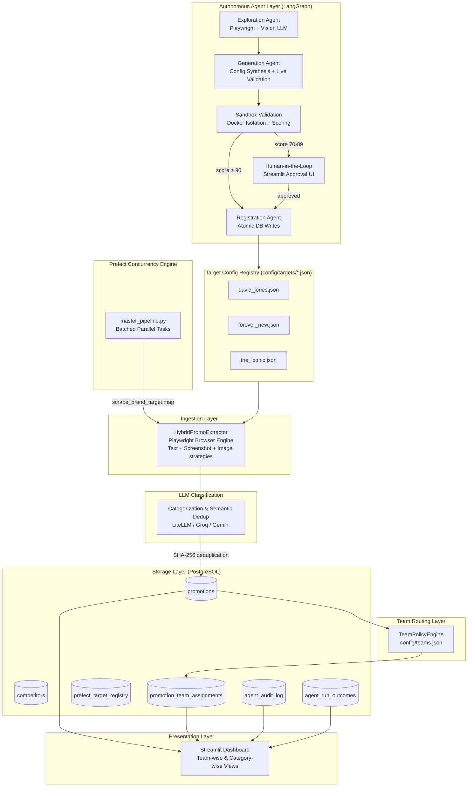
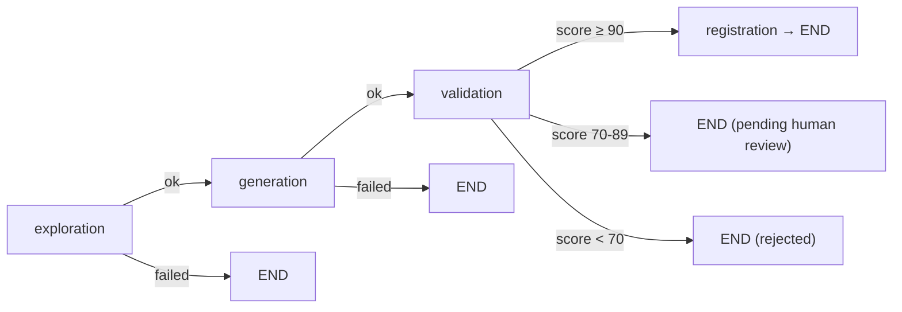
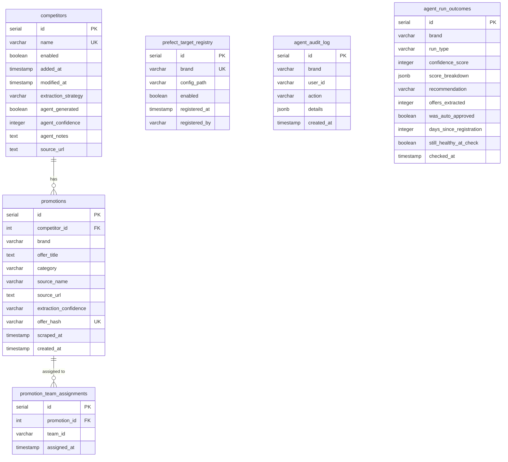

# Retail Competitive Intelligence Scraper — Architecture & Implementation

---

## 1. Executive Summary

The Retail Competitive Intelligence Scraper is a production-grade, end-to-end competitive promotion tracker with an **Autonomous Scraper Agent pipeline**. The platform continuously monitors competitor websites (such as **David Jones**, **Forever New**, **The Iconic**, and **Sephora**) in parallel using a hybrid scraper, autonomously discovers and registers new brand targets via a **LangGraph agent pipeline**, executes validation inside an isolated **Docker sandbox**, and routes clean offer data into team feeds via a configurable policy engine.

---

## 2. System Architecture

The platform consists of five layers: autonomous agent, ingestion, storage, routing, and presentation.



---

## 3. Autonomous Scraper Agent Pipeline

The platform includes an end-to-end **LangGraph Autonomous Agent** that builds, validates, and registers scraper configurations for new retail sites without manual coding.

### 3.1 Agent Workflow



### 3.2 Node Descriptions

| Node | File | Responsibility |
|---|---|---|
| **Exploration** | `agent/exploration_agent.py` | Playwright site navigation, full-page screenshots, DOM capture, anti-bot risk scoring, Vision LLM analysis |
| **Generation** | `agent/generation_agent.py` | LLM-based JSON config synthesis, CSS selector cleanup, live selector validation via Playwright |
| **Validation** | `agent/validation_agent.py` | Docker sandbox execution, offer schema validation, confidence score computation (0–100) |
| **Registration** | `agent/registration_agent.py` | Atomic DB transaction: UPSERT competitors + INSERT prefect_target_registry + INSERT agent_audit_log |

### 3.3 Confidence Score Breakdown

| Component | Points | Condition |
|---|---|---|
| Yield base | +70 | ≥ 5 offers or ≥ 80% of estimated yield |
| Yield base | +50 | ≥ 1 offer (but below threshold above) |
| Schema quality | +20 | 100% of offers pass schema validation |
| Schema quality | +10 | ≥ 80% of offers pass schema validation |
| Title population | +5 | All offers have non-empty title |
| Category population | +5 | ≥ 80% of offers have a category |
| Discount population | +5 | ≥ 50% of offers have discount_min |
| Anti-bot penalty | -20 | High anti-bot risk site |
| Anti-bot penalty | -5 | Medium anti-bot risk site |
| Sandbox violation | → 0 | Any violation forces score to 0 |

### 3.4 Docker Sandbox Security

The sandbox container (`docker/Dockerfile.sandbox`) enforces:
- **Resource limits**: 768 MB RAM, 1 CPU, 128 PIDs
- **Read-only root filesystem** with tmpfs for `/tmp` (256 MB) and `/dev/shm` (256 MB)
- **All Linux capabilities dropped** (`cap_drop=ALL`, `no-new-privileges`)
- **Network egress isolation**: `scraper-egress-only` Docker network
- **Violation detection**: OOM kills, filesystem writes, and blocked network access are detected and force auto-rejection

---

## 4. Data Ingestion & Extraction Strategy

### 4.1 Target Configuration File Structure
Each site has a standalone, declarative configuration file inside `config/targets/` defining elements to target:
- `brand`: Brand string representation.
- `source_url`: URL of the promotion/sale landing page. Can be a single string URL, a list of URL strings, or a list of `{"url": "...", "category_hint": "..."}` objects for per-page LLM category context.
- `enabled`: Optional boolean (`true` | `false`) to temporarily enable or disable the scraper target. Defaults to `true` if not specified.
- `extraction_strategy`: One of `"text"`, `"screenshot"`, `"image"`, or `"hybrid"` (text + screenshot combined).
- `text_selectors`: CSS selectors targeting banners, headers, and promo blocks for text extraction.
- `screenshot_selectors`: CSS selectors targeting elements containing visual offers (processed by Vision LLM).
- `banner_selectors`: CSS selectors for `` src URL collection (image strategy only).
- `request_delay_seconds`: Delay between Vision API calls (default 4).
- `scroll_depth`: Scroll iterations to trigger lazy loading (default 3).
- `category`: Top-level fallback category. If the LLM assigns "Others" but this field is set (e.g. `"Beauty"`), the system overrides the LLM's choice.
- `category_hint`: Per-URL or top-level string injected into the LLM categorization prompt as a strong prior.
- `promo_keywords_pattern`: Optional custom regex for promotional text filtering.

### 4.2 In-Browser JavaScript Element Extraction
To prevent rate limiting and handle hidden mobile banners or responsive designs (which fail standard screenshotting), the scraper uses Playwright to evaluate DOM elements. For hidden images, a browser-side fetch fetches image bytes directly using the browser's credentials to bypass CDN/CORS protections. All strategies use stealth browser settings (custom user-agent, `sec-ch-ua` headers, WebDriver property removal) to bypass Cloudflare/Akamai bot detection.

### 4.3 LLM Category Classification & Semantic Deduplication
After extraction, all offers for a brand are sent to the LLM in a single batched call for:
1. **Filtering** — removes non-promotional items (loyalty programs, newsletter signups, shipping notices).
2. **Semantic deduplication** — groups offers referring to the same campaign and selects a clean canonical title.
3. **Categorization** — assigns each offer to one of the categories defined in the `PROMO_CATEGORIES` environment variable.
4. **Category fallback override** — if the LLM assigns "Others" but the target config declares a top-level `category` field, the system overrides the LLM's choice.

### 4.4 SHA-256 Deduplication
Before writing promotions to the database, a unique SHA-256 fingerprint is calculated:
```python
offer_hash = SHA256(source_name + brand + source_url + offer_title + scraped_date)
```
If the database already contains a record with the same `offer_hash`, the scraper updates the `scraped_at` timestamp. Otherwise, it inserts a new promotion row. The date component ensures the same offer is re-recorded daily for timeline tracking.

---

## 5. Team Routing

Business team routing is controlled by `config/teams.json` and is applied after promotions are stored.

1. Each promotion has an LLM-assigned `category` and a `brand`.
2. `TeamPolicyEngine` evaluates each promotion against team rules: category matching, allowed brands, excluded brands.
3. Matching team IDs are written to the `promotion_team_assignments` junction table.
4. A promotion can belong to multiple teams.

Re-apply routing without re-scraping:
```bash
python scripts/reassign_teams.py
```

---

## 6. Database Schema

Managed via SQLAlchemy with Alembic migrations, the database uses **six tables**:

### 6.1 ER Diagram



### 6.2 Table Reference

- **`competitors`**: Registry of retail competitor brands. Includes agent-generated metadata (`agent_generated`, `agent_confidence`, `agent_notes`, `source_url`).
- **`promotions`**: Core promotions table containing extracted offers, LLM-assigned category, source URL, extraction confidence, and timestamps.
- **`promotion_team_assignments`**: Junction table recording which business teams should see each promotion. Managed by `TeamPolicyEngine`.
- **`prefect_target_registry`**: Active registry of brands registered for automated Prefect pipeline scraping. Written by the registration agent.
- **`agent_audit_log`**: Immutable audit trail for all agent actions: trigger, approve, reject, edit_config.
- **`agent_run_outcomes`**: Historical confidence scores and validation metrics for both initial validation and recurring health checks.

---

## 7. Environment Variables

| Variable | Description | Default |
|---|---|---|
| `DATABASE_URL` | PostgreSQL connection string | *(required)* |
| `LLM_PROVIDER` | Primary LLM provider: `groq` or `litellm` | `groq` |
| `LLM_FALLBACK` | Fallback LLM provider for rate-limit auto-retry | *(unset)* |
| `LLM_MODEL` | Model name for text/reasoning LLM calls | `llama-3.3-70b-versatile` |
| `GROQ_API_KEY` | API key for Groq provider | — |
| `LITELLM_API_BASE` | LiteLLM gateway URL (enables LiteLLM mode) | *(unset = direct provider)* |
| `LITELLM_API_KEY` | API key for LiteLLM gateway | — |
| `VISION_LLM_MODEL` | Model name for vision LLM calls | `openai/claude-haiku-4.5` |
| `GEMINI_API_KEY` | Direct Gemini API key (fallback provider) | — |
| `PROMO_CATEGORIES` | Comma-separated category taxonomy for LLM classifier | *(required)* |
| `AGENT_USER_ID` | User identity for RBAC audit trail | `default_operator` |
| `SANDBOX_TIMEOUT_SECONDS` | Docker sandbox wall-clock timeout | `240` |
| `SKIP_LIVE_SELECTOR_VALIDATION` | Skip Playwright selector validation in generation | `false` |
| `MAX_CONCURRENT_BROWSERS` | Max parallel Playwright browsers in Prefect flow | `4` |
| `VISION_API_MIN_DELAY` | Minimum seconds between Vision API dispatches | `4.5` |
| `VISION_COST_PER_MILLION_TOKENS_USD` | Cost estimate rate for API tracking | `1.00` |
| `DASHBOARD_LOOKBACK_DAYS` | Rolling window for dashboard queries (days) | `90` |

---

## 8. Operations & Runbook

### Run Autonomous Agent for New Brand
```bash
python scripts/run_scraper_agent.py --url "https://www.example.com/" --brand "Example Brand"
```

### Standalone Sequence Run
```bash
python scripts/run_hybrid_promo_scraper.py
```

### Single Target Run
```bash
python scripts/run_hybrid_promo_scraper.py --target config/targets/the_iconic.json
```

### Mapped Concurrency Run (Prefect)
```bash
python flows/master_pipeline.py
```

The master pipeline generates a structured summary report containing:
- **Per-brand results table** — success/error status, offers extracted, stored, and cost per brand
- **Aggregate stats** — total brands, offers, stored count, cost, and success rate
- **Failed Sites table** — brands that encountered errors during extraction
- **Zero Offers table** — brands that completed successfully but extracted no promotional offers

### Database Initialization
To create tables on a fresh setup:
```bash
python scripts/init_db.py
```

### Database Clean Up
To wipe and reset promotions and competitor tables:
```bash
python scripts/reset_db.py
```

### Re-apply Team Routing
After editing `config/teams.json`, re-assign all existing promotions:
```bash
python scripts/reassign_teams.py
```

### Launch the Dashboard
To start the Streamlit web dashboard to filter and view promotions:
```bash
streamlit run dashboard/app.py
```

### Build Docker Sandbox Image
```bash
docker build -t promo-scraper-sandbox:latest -f docker/Dockerfile.sandbox .
./docker/setup_egress_network.sh create <target-domain>
```
